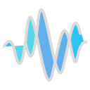

    <picture>
        <source srcset="img/peak-white-128.png" media="(prefers-color-scheme: dark)">
        <source srcset="img/peak-128.png" media="(prefers-color-scheme: light)">
        
    </picture>

# Peak

Peak is a library that is aimed at performing computations related to noise and signal processing.
It has 