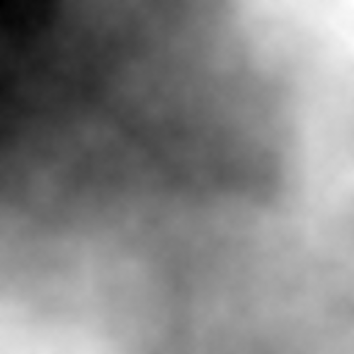

<div align="center">
    
</div>

# PEAK Library

PEAK stands for **Procedural Environment Algorithms for Kotlin**. It is a collection of various algorithms, noise types, 
modifiers, masks, filters, data extraction tools and more for creating and manipulating heightmaps.

## Features

PEAK primarily focuses on the generation of heightmaps. Even though there are already plenty of libraries for this
out there, PEAK stands out because of the variety of algorithms it offers. While it offers you to, it doesn't force you 
to use old techniques. Instead, it allows to combine these together with new features, filters and operators to create
realistic looking terrains.

## Table Of Content

Here is the table of content which describes all features of PEAK:

- [**Noise Providers**](#noise-providers)
- [**Primitives**](#primitives)
- [**Simulation**](#simulation)
- [**Operators**](#operators)
- [**Filters**](#filters)
- [**Masks**](#masks)
- [**Data Extractors**](#data-extractors)
- [**3D Engine**](#3d-engine)

### Noise Providers

Noise providers form at the basis of PEAK. They form the backbone of any combination of noise, operator, filter or
mask. All noise providers extend `SimpleNoiseProvider`. A custom noise provider that outputs a uniform value can be
implemented as follows:

```kotlin
class CustomNoiseProvider(private val value: Float) : SimpleNoiseProvider() {
    
    override fun noise(x: Int, z: Int): Float {
        return value
    }

    override fun noise(x: Float, z: Float): Float {
        return value
    }

    override fun noise(x: Double, z: Double): Double {
        return value.toDouble()
    }
    
}
```

There are two pre-built providers: `FastNoiseProvider`, which implements the famous [FastNoise](https://github.com/Auburn/FastNoiseLite) 
library written by Jordan Peck. It provides the following types of noise:

- (Fractal) **Value** Noise
- (Fractal) **Perlin** Noise
- (Fractal) **Simplex** Noise
- **Cellular** Noise
- **White** Noise

The `FastNoiseProvider` relies on certain parameters. Therefor, you can construct a `FastNoiseProviderData`-object,
which stores these parameters. This data class can be build using a builder as follows:

```kotlin
val providerData = FastNoiseProviderDataBuilder()
    .build()
val fastNoiseProvider = FastNoiseProvider(providerData)

println("Noise at x=0, y=0: ${fastNoiseProvider.noise(0, 0)}")
```

With the builder, you can modify parameters such as:

- seed
- octaves
- gain
- lacunarity
- type of noise

All builder functions are explained within the [WIKI](https://github.com/PolyRocketMatt/Peak/wiki).

Analogous, the `ComplexNoiseProvider` provides more complex forms of noise. Currently, it provides the following
types of noise:

- **Polynomial** Noise (Originally developed by Yann Thorimbert & Bastien Chopard)

The `ComplexNoiseProvider` relies on certain parameters. Therefor, you can construct a `ComplexNoiseProviderData`-object,
which stores these parameters. This data class can be build using a builder as follows:

```kotlin
val providerData = ComplexNoiseProviderDataBuilder()
    .build()
val complexNoiseProvider = ComplexNoiseProvider(providerData)

println("Noise at x=0, y=0: ${complexNoiseProvider.noise(0, 0)}")
```

The builder works analogue to the previously described builder. All builder functions are explained within 
the [WIKI](https://github.com/PolyRocketMatt/Peak/wiki).

### Primitives

### Simulation

### Operators

### Filters

### Masks

### Data Extractors

### 3D Engine

~ Soon

<div align="center">
    
</div>

---

<div align="center">Made with ❤️ in Leuven</div>
