# PEAK Library

PEAK stands for **Procedural Environment Algorithms for Kotlin**. It is a collection of various algorithms, noise types, 
modifiers, masks, filters, data extraction tools and more for creating and manipulating heightmaps 🗺️.

## Features

PEAK primarily focuses on the generation of heightmaps. Even though there are already plenty of libraries for this
out there, PEAK stands out because of the variety of algorithms it offers. While it offers you to, it doesn't force you 
to use old techniques. Instead, it allows to combine these together with new features, filters and operators to create
realistic looking terrains.

## Quickstart

Here is the table of content which describes all features of PEAK:

- [**Noise Providers & Evaluators**](#noise-providers--evaluators)
- [**Primitives**](#primitives)
- [**Simulation**](#simulation)
- [**Operators**](#operators)
- [**Filters**](#filters)
- [**Masks**](#masks)
- [**Data Extractors**](#data-extractors)
- [**3D Engine**](#3d-engine)

More detailed information on how to use PEAK can be found on the [WIKI](https://github.com/PolyRocketMatt/Peak/wiki).

---

### Noise Providers & Evaluators

Peak has a variety of noise providers and evaluators. Providers wrap certain evaluators for ease of use, but
both can be used to sample noise. There are five categories of noise offered: simple, pattern-based, complex, cellular
and bounded noise.

**1. Simple Noise Types**

Simple noise types that many libraries implement as well.

   - White noise
   - Value noise
   - Simplex noise
   - Multi-fractal noise (can be based on value or simplex noise)
   - Smooth multi-fractal noise (exclusion of octaves)

Examples:

|                 Fractal                 |                 Smooth                 |                 Simplex                 |                    Value                     |                 White                 |
|:---------------------------------------:|:--------------------------------------:|:---------------------------------------:|:--------------------------------------------:|:-------------------------------------:|
| 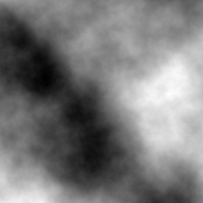 |  | 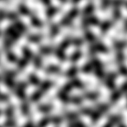 | 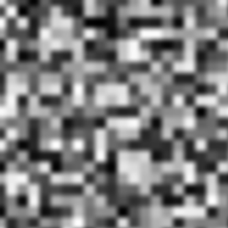 | 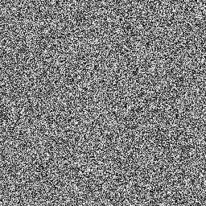 |

(*Note: scale has been modified to produce better examples*)

**2. Pattern-based Noise Types**

Pattern-based noises create repeated patterns. These are useful for texturing or filtering.

  - Checkerboard noise
  - Grid noise
  - Radial-stripe noise
  - Straight-stripe noise (horizontal, vertical or diagonal)

Examples:

|                 Checkerboard                 |                 Grid                 |             Radial Stripe              |        Straight Stripe (Diagonal)        |
|:--------------------------------------------:|:------------------------------------:|:--------------------------------------:|:----------------------------------------:|
| 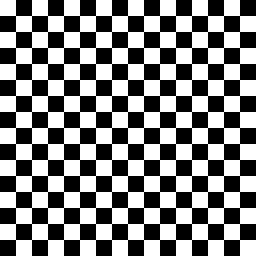 | 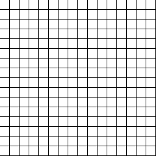 |  | 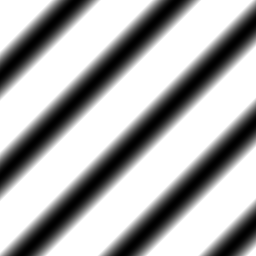 |

(*Note: scale has been modified to produce better examples*)

**3. Complex Noise Types**

Complex noise types combine other noise types to create interesting noise patterns.

  - Buya Noise (inspired by [Buya Noise (Cinema4D)](https://developers.maxon.net/docs/Cinema4DPythonSDK/html/types/noise.html#buya))

Examples:

|                 Buya                 |
|:------------------------------------:|
| 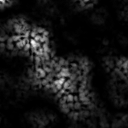 |

(*Note: scale has been modified to produce better examples*)

**4. Cellular Noise Types**

Cellular noise creates a cell-like structured noise. 

  - Cellular noise (also known as Voronoi)
  - Poisson noise (uses poisson samples as sample points, instead of a static sample array)

Examples:

|                 Cellular                 |
|:----------------------------------------:|
| 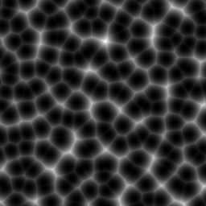 |

(*Note: scale has been modified to produce better examples*)

**5. Bounded Noise Types**

Bounded noise improves or amortizes certain noise types, but has the disadvantage of being bounded by
a single size parameter (see [WIKI](https://github.com/PolyRocketMatt/Peak/wiki) for more detail)

  - Perlin noise 
  - Polynomial noise (fast multi-fractal noise)

Examples:

|                    Perlin                     |                 Polynomial                 |
|:---------------------------------------------:|:------------------------------------------:|
| 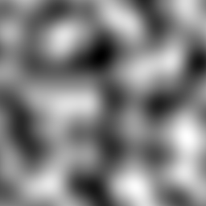 |  |

(*Note: scale has been modified to produce better examples*)

### Primitives

### Simulation

PEAK also offers certain types of simulation. These simulations alter the heightmaps you provide them with.
Currently, the following three simulations are available:

- Hydraulic Erosion
- Aeolian Erosion
- Thermal Erosion

Example of hydraulic erosion:

|                          Before                          |                          After                          |
|:--------------------------------------------------------:|:-------------------------------------------------------:|
| 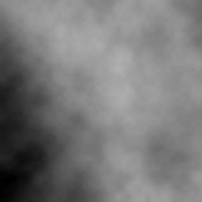 | 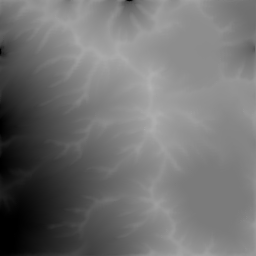 |

Example of Aeolian erosion:

|                         Before                         |                         After                         |
|:------------------------------------------------------:|:-----------------------------------------------------:|
| 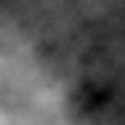 | 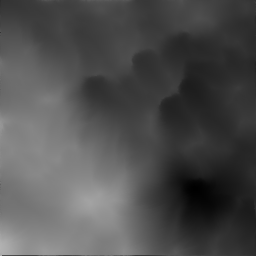 |

### Operators

PEAK offers a way to store heightmaps efficiently and operate on them in an (a)sync way: buffers. 
On these buffers, various operations can be performed.

**Scalar Operations**

- Addition
- Subtraction
- Multiplication
- Division

**Unary Operations**

- Clipping
- Exponentiation
- Inverting
- Lerp (linear interpolation)
- Normalisation
- Polynomial evaluation
- Push/Pull
- Scaling
- Smooth(er)step and other [0,1]-interval based functions
- Square-root

**Binary Operations**

- Addition
- Subtraction
- Multiplication
- Division
- Blending
- Combined Power (uses the elements from the second buffer as exponents)
- Min/Max

### Filters (Planned)

Filters will provide a way of filtering buffers.

### Data Extractors (Planned)

Data extractors will be used to extract data from buffers. This can include flow maps, angle maps, etc.
These can then be used to perform other operations on the buffers based on the collected data.

### 3D Engine (Planned)

A layer-based buffer will be introduced to allow for 3D noise generation, erosion, operation and filtering.

---

Made with ❤️ in Leuven

