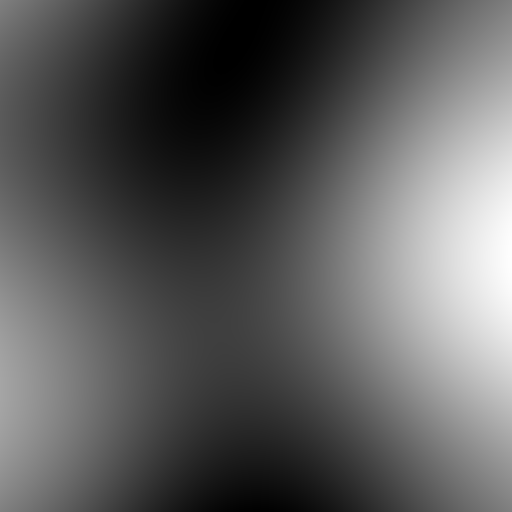
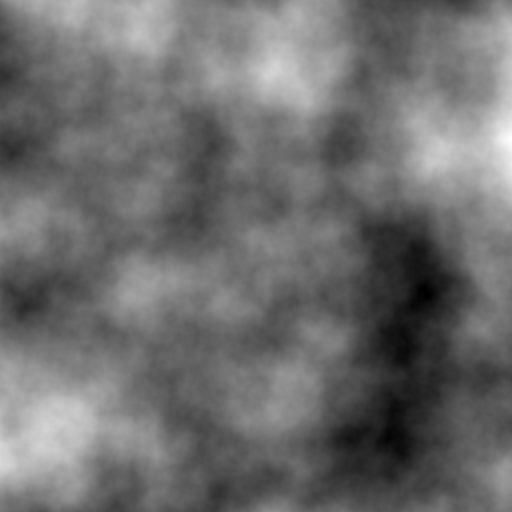
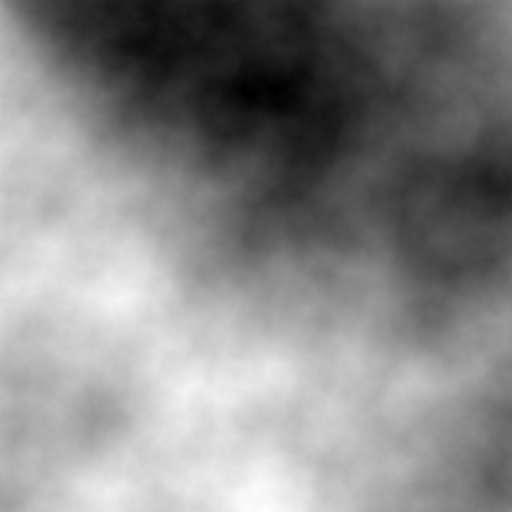

<div align="center">
    
</div>

# PEAK Library

PEAK stands for **Procedural Environment Algorithms for Kotlin**. It is a collection of various types of procedural
noise, algorithms and utilities to create quasi-realistic looking heightmaps. It runs based of the GAME library 
which was written at the same time. While GAME offers more geometric and mathematical utilities, the algorithms
for this type of procedural generation deserve their own library.

## Features

PEAK primarily focuses on the generation of heightmaps. Even though there are already plenty of libraries for this
out there, PEAK stands out because of the variety of algorithms it offers. It doesn't force you to use ~30 year old
techniques but offers you to use more contemporary algorithms such as different types of erosion, river-generation,
etc.

## Papers

PEAK is based on a collection of papers. These describe new and exciting techniques on how to create procedural 
landscapes. Below is a non-exhaustive lists of papers used whose algorithms are (partially) implemented:

- [Orometry-based Terrain Synthesis](https://hal.archives-ouvertes.fr/hal-02326472/file/2019-orometry.pdf)
- [Terrain Generation using Diffusion Equation](https://perso.liris.cnrs.fr/eric.galin/Articles/2010-terrain.pdf)
- [Terrain Generation using Tectonic Uplift/Fluvial Erosion](https://hal.inria.fr/hal-01262376/document)
- [Polynomial Method for Procedural Terrain Generation](https://arxiv.org/pdf/1610.03525.pdf)
- [Procedural Noise using Sparse Gabor Convolution](https://graphics.cs.kuleuven.be/publications/LLDD09PNSGC/)

I would like to thank all authors without whom this project would have never been possible.

## Table Of Content

Here is the table of content which describes all features of PEAK. Note that some processes can take a substantial
amount of time when performed on larger areas/sizes (most notably: erosion).

**Noise Library**

- [Noise Types](#noise-types)
- [Noise Builder](#noise-builder)
- [Noise Algorithms](#noise-related-algorithms)

## Noise Library

### Noise Types

Currently, PEAK offers 3 types of noises:

- Perlin Noise
- Simplex Noise
- Polynomial Noise

These noises are enough to describe various types and all other types of noise
can be derived from these. 

**Perlin Noise**

PEAK offers a custom implementation of Perlin Noise which is available as ```PerlinNoise```, which is a Kotlin 
implementation of Ken Perlin's [Improved Perlin Noise](https://mrl.cs.nyu.edu/~perlin/paper445.pdf). It is advised 
to only use Perlin Noise in these cases:

- Small patches of noise are to be generated
- The derivative of the noise has to be known

An example of Perlin Noise with a single octave:

<div align="center">
    
</div>

An example of Perlin Noise with 8 octaves (*gain=0.5, lacunarity=2.0*)

<div align="center">
    
</div>

**Simplex Noise**

Simplex Noise is the better version of Perlin Noise which is available as ```OpenSimplexNoise```. The implementation is based on 
[this article](https://weber.itn.liu.se/~stegu/simplexnoise/simplexnoise.pdf) by Stefan Gustavson. It can be
used to generate larger areas of noise or patches of noise that have to be infinite.

An example of Simplex Noise with 8 octaves (*gain=0.5, lacunarity=2.0*)

<div align="center">
    
</div>

**Polynomial Noise**

Finally, PEAK also offers Polynomial Noise, originally developed by Yann Thorimbert in his 
[paper](https://arxiv.org/pdf/1610.03525.pdf). To our knowledge, this is the first 3-th party
implementation of the paper that has been published. Polynomial noise is a fascinating take
on noise. It produces the same quality of Simplex Noise but is faster to compute. This type
of noise is not infinite and is thus only useful for fast patches of noise (these patches 
can be quite large). It is available as ```PolynomialNoise```. 

*Note:* Polynomial Noise pre-generates it's values and can only do so in a square-shape.

An example of Polynomial Noise with 8 octaves (*lacunarity=2.0*)

<div align="center">
    
</div>

### Noise Builder

The noise-builder is used to generate buffers for different types of noise. These buffers hold the 
data that the noises need to compute their values.

### Noise-related Algorithms